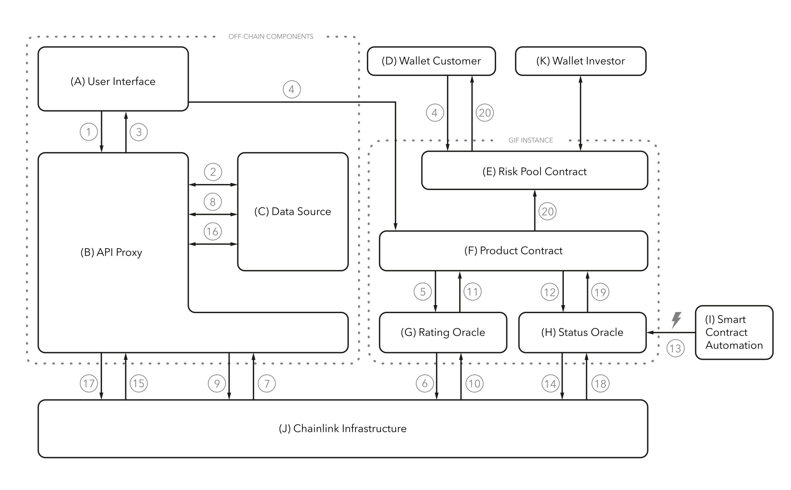

# Community Supported Insurance

The idea is to research and implement a blockchain-based system for decentralized risk coverage. The added value compared to traditional insurance can be summarized as follows: significantly better capital utilization through savings in administrative costs, coverage of new risks that have not been covered by traditional insurance companies so far, a community-oriented approach where everyone can participate, and scalability of the solution including internationalization capabilities.

🌐 Website: [Community Supported Insurance](https://csi.hs-mittweida.de/)

_The project is funded by the German Federal Ministry of Education and Research under grant
number 03WIR1316A._

## Project Partners

### Etherisc

[Etherisc](https://etherisc.com) is a pioneer in blockchain insurance. Their goal is to make insurance fair and accessible through an open source, decentralized insurance protocol to collectively build insurance products on the Ethereum blockchain. The open-source common infrastructure, the Generic Insurance Framework (GIF), includes shared smart contracts, product templates, microservices and the native cryptographic token (DIP) to enable the seamless and efficient creation of decentralized insurance products, with increased transparency and fairness for all parties.

### Blockchain Competence Center Mittweida (BCCM)

The [Blockchain Competence Center Mittweida (BCCM)](https://blockchain.hs-mittweida.de/) is part of the Faculty of Applied Computer and Life Sciences at Mittweida University of Applied Sciences. They work with businesses, financial institutions, and government organizations as a partner for blockchain development and consulting.

## Train Delay Protection

At the beginning of the project, a workshop was organized to collect numerous ideas from different areas. After thorough evaluation, the focus was set on train delay protection. This service allows train passengers to insure their train connections and receive compensation in case of delays. The amount of compensation is determined based on the risk of delay, which is calculated using historical train data through a prediction component powered by machine learning (ML).

### Architecture

The following diagram shows the system architecture. On the left side, you can find components outside the blockchain (website and traditional backend on a server). On the right side are the components located on the blockchain. For data transfer between the real world and the blockchain, we used Chainlink as the oracle solution.

Several key components have been developed: a frontend for purchasing train delay protection, a backend for providing train data, a prediction server that performs risk assessment for train connections, and smart contracts within the Generic Insurance Framework. A complete description of all components and their workflows can be found in a paper published in 2022: [A technical approach for blockchain-based parametric insurance](https://monami.hs-mittweida.de/frontdoor/deliver/index/docId/13451/file/13451.pdf).

## Repositories

**⚠️ Important Notice**: The following repositories may contain deprecated code, as they were developed in 2022. Always refer to the latest documentation and protocol specifications before using this code in production environments.

- [User Interface](https://github.com/b2cm/csi_train_ui)
- [Prediction Component](https://github.com/b2cm/csi_train_prediction)
- [Backend Service](https://github.com/b2cm/csi_train_service)
- [Smart Contracts](https://github.com/b2cm/csi_train_contracts)
- [Chainlink Jobs](https://github.com/b2cm/csi_train_chainlink)
- [Monerium Service](https://github.com/b2cm/csi_monerium_service)

## Materials

- Research Paper: [A technical approach for blockchain-based parametric insurance](https://monami.hs-mittweida.de/frontdoor/deliver/index/docId/13451/file/13451.pdf)
- Promotional Video: [Available on Youtube](https://www.youtube.com/watch?v=qABUPaiuvV0)
- Event Demonstratortag: [Available on Youtube](https://www.youtube.com/watch?v=JSnFnNbhNaw)
- Master thesis: [Entwicklung eines Vorhersagemodells für Zugverspätungen durch maschinelles Lernen und anschließende Integration in eine Blockchainanwendung](https://monami.hs-mittweida.de/frontdoor/deliver/index/docId/14355/file/40723-johns-lucas-master-thesis_geschwaerzt.pdf)

## Results

The project successfully delivered a fully functional prototype of a train delay protection product for Germany. The implementation covered the full insurance workflow — from risk assessment and policy creation to claims evaluation and payouts. A key milestone was the integration of a payment system that enables users to purchase blockchain-based insurance coverage via SEPA bank transfers, making the product accessible even to those without Web3 wallets. The project concluded with a three-month pilot phase during which real customers were able to purchase train delay protection.

## Inquiries

For questions or collaboration inquiries, please contact us at [bccm@hs-mittweida.de](mailto:bccm@hs-mittweida.de).